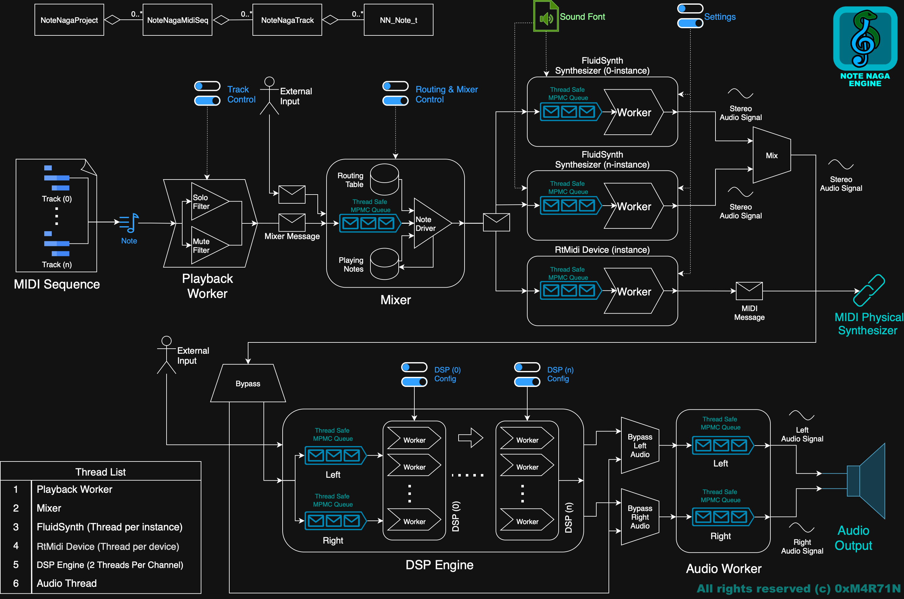

<div align="center">


# 🎵 Note Naga MIDI Editor 🎵

[](https://github.com/0xMartin/NoteNagaCPlusPlus)
[](LICENSE)
[](https://github.com/0xMartin/NoteNagaCPlusPlus)

**A powerful, feature-rich MIDI editor with advanced audio processing capabilities**

[Features](#-features) • [Screenshots](#-screenshots) • [Installation](#-installation) • [Usage](#-usage) • [Architecture](#-architecture) • [Todo](#-todo) • [Contributing](#-contributing)

</div>

---

## 📖 Overview

Note Naga is a professional MIDI editor built with C++ and Qt, featuring a custom real-time audio engine. It provides comprehensive tools for MIDI composition, editing, mixing, and audio processing with an intuitive graphical interface.

## ✨ Features

### 🎹 MIDI Editing
- **Piano Roll Editor** - Visual note editing with grid snapping and multiple selection
- **Multi-track Support** - Unlimited MIDI tracks with individual routing
- **Advanced Note Manipulation**:
  - ✂️ Quantize notes to grid
  - 🎲 Humanize timing and velocity
  - 🎼 Transpose notes
  - 📊 Velocity editing and scaling
  - ⏱️ Duration editing and scaling
  - 🎵 Legato and Staccato modes
  - 🔄 Invert and retrograde transformations
  - 🧹 Delete overlapping notes
  - ⏰ Scale timing
- **Flexible Grid System** - Multiple resolution options (whole, half, quarter, eighth, etc.)
- **Follow Modes** - Center, left-side, step-by-step, and none
- **Loop Playback** - Seamless loop support for composition workflow

### 🎚️ Mixing & Routing
- **Track Mixer** - Per-track volume, pan, mute, and solo controls
- **Visual Volume Meters** - Real-time multi-channel volume visualization
- **Instrument Assignment** - Support for FluidSynth (SoundFont) and external MIDI devices
- **Flexible Routing** - Connect tracks to different synthesizers and DSP chains

### 🎛️ Audio Processing (DSP Engine)

The engine includes **18 professional DSP effects**:

| Effect | Description |
|--------|-------------|
| 🔊 **Gain** | Volume control with dB scaling |
| 🎚️ **Pan** | Stereo positioning |
| ⚡ **Compressor** | Dynamic range compression |
| 🚫 **Limiter** | Peak limiting protection |
| 🌊 **Noise Gate** | Automatic noise reduction |
| 🎚️ **Single EQ** | Parametric equalizer (single band) |
| 📊 **Multi EQ** | Multi-band equalizer |
| 🎸 **Filter** | Low-pass, high-pass, band-pass filters |
| 🌌 **Reverb** | Room and hall reverb effects |
| ⏱️ **Delay** | Echo and delay effects |
| 🎵 **Chorus** | Thickening and doubling |
| 🌀 **Flanger** | Jet-like modulation |
| 🎭 **Phaser** | Phase-shifting modulation |
| 🔥 **Saturator** | Harmonic saturation and warmth |
| ⚡ **Exciter** | High-frequency enhancement |
| 🎪 **Tremolo** | Amplitude modulation |
| 📡 **Stereo Imager** | Stereo width control |
| 🎲 **Bitcrusher** | Lo-fi digital distortion |

### 📊 Audio Analysis
- **Spectrum Analyzer** - Real-time frequency spectrum visualization
- **Volume Indicators** - LED-style volume meters with peak detection

### 🎬 Media Export
- **Video Export** - Export MIDI performance as video with visual piano roll
- **MIDI Export** - Save projects as standard MIDI files *(coming soon)*
- **Customizable Video Settings** - Resolution, FPS, codec options
- **Real-time Preview** - Preview video output before export

### 🎼 Synthesizers
- **FluidSynth Integration** - High-quality SoundFont-based synthesis
- **External MIDI Support** - Route to hardware synthesizers
- **Multi-instance Support** - Multiple synthesizer instances per project

### 🎨 User Interface
- **Modern Dark Theme** - Eye-friendly dark color scheme
- **Flexible Dock System** - Customizable workspace layout
- **Keyboard Shortcuts** - Efficient workflow with hotkeys
- **Responsive Design** - Smooth interaction and real-time updates

## 📸 Screenshots

<div align="center">

### Main Editor Interface


### Audio Export Interface


> Video export example: [https://youtu.be/78l0hsS38Ow](https://youtu.be/78l0hsS38Ow)

</div>

## 🏗️ Architecture

Note Naga is built on a modular architecture separating the GUI from the audio engine:

### Project Structure
```
NoteNaga/
├── src/                    # GUI application
│   ├── gui/               # Main window and UI components
│   │   ├── components/    # Reusable UI widgets
│   │   ├── dialogs/       # Dialog windows
│   │   ├── dock_system/   # Custom dock system
│   │   ├── editor/        # Piano roll editor
│   │   └── widgets/       # Track list, mixer, DSP widgets
│   ├── media_export/      # Video/audio export functionality
│   └── main.cpp           # Application entry point
│
└── note_naga_engine/      # Audio engine library
    ├── core/              # Core types and project data
    ├── dsp/               # DSP effect blocks
    ├── io/                # MIDI file I/O
    ├── module/            # Engine modules (mixer, playback, etc.)
    └── synth/             # Synthesizer implementations
```

### Engine Architecture



The audio engine features a **multi-threaded architecture**:

1. **Playback Worker** - Reads MIDI sequences and sends note events to mixer
2. **Mixer** - Routes notes to appropriate synthesizers and processes audio
3. **DSP Engine** - Applies effect chains to audio streams
4. **Audio Worker** - Manages audio output callback and buffer management
5. **Spectrum Analyzer** - Real-time frequency analysis

### Data Flow
```
MIDI File → Project Data → Playback Worker → Mixer → Synthesizers
                                                  ↓
                                            DSP Engine → Audio Output
```

## 🛠️ Installation

### Prerequisites
- **CMake** 3.16 or higher
- **Qt** 5 or 6 (Widgets, Concurrent, Svg)
- **OpenCV** (for video export)
- **FluidSynth** (for SoundFont synthesis)
- **C++17** compatible compiler

### Build Instructions

#### Clone the repository
```bash
git clone https://github.com/0xMartin/NoteNagaCPlusPlus.git
cd NoteNagaCPlusPlus
```

#### Build with Qt support (GUI + Engine)
```bash
cmake -S . -B build
make -C build -j8
```

#### Build engine only (no Qt dependencies)
```bash
cd note_naga_engine
cmake -S . -B build -DQT_DEACTIVATED=ON
make -C build -j8
```

#### Run the application
```bash
./build/NoteNaga.app/Contents/MacOS/NoteNaga  # macOS
./build/NoteNaga                               # Linux
./build/NoteNaga.exe                           # Windows
```

## 🚀 Usage

### Basic Workflow

1. **Load MIDI File**: `File → Open` to load an existing MIDI file
2. **Edit Notes**: Click and drag in the piano roll to create/modify notes
3. **Configure Instruments**: Assign SoundFonts to tracks in the mixer
4. **Apply Effects**: Add DSP blocks to tracks or master output
5. **Playback**: Use transport controls to play and navigate
6. **Export**: `File → Export Video` to render performance

### Keyboard Shortcuts

| Shortcut | Action |
|----------|--------|
| `Space` | Play/Pause |
| `Home` | Go to start |
| `End` | Go to end |
| `Ctrl+O` | Open MIDI file |
| `Ctrl+E` | Export video |
| `Ctrl+Q` | Quit application |

### MIDI Utilities

Access advanced MIDI editing tools from the `Edit` menu:
- **Quantize** - Snap notes to grid
- **Humanize** - Add natural timing variations
- **Transpose** - Shift pitch up/down
- **Velocity Tools** - Set or scale note velocities
- **Duration Tools** - Adjust note lengths
- **Articulation** - Apply legato or staccato

## 📋 Todo

### 🔴 High Priority (v1.0)
- [ ] 🐛 **Fix**: Newly added notes not playing during playback
- [ ] 💾 **MIDI Export**: Save projects as standard MIDI files
- [ ] 💾 **Project Save/Load**: Complete project persistence
- [ ] 📁 **Project Explorer**: Dialog for new/open/recent projects

### 🟡 UI/UX Improvements
- [ ] 🎨 **Section-based Layout**: Split app into dedicated sections
  - MIDI Editor: Track list + Piano roll + Mixer
  - DSP Editor: DSP blocks + Volume indicator + Spectrum analyzer + Track preview
  - Export: Media export dialog
- [ ] 🖱️ **Context Menus**: Right-click menus for all major components
- [ ] 📊 **Velocity Editor**: Visual velocity editing panel
- [ ] ✏️ **Enhanced Note Editing**: Better manipulation and selection tools
- [ ] 🎯 **Apply to Selection**: MIDI utilities work on selected notes only (or all if none selected)

### 🟢 Advanced Features
- [ ] 🎹 **MIDI Input**: Record notes from external MIDI devices
- [ ] ↩️ **Undo/Redo**: History system for all edit operations
- [ ] 🔌 **Plugin Support**: VST/AU plugin integration
- [ ] 🎛️ **Automation**: Automate mixer and effect parameters over time
- [ ] 📝 **Notation View**: Traditional music notation display
- [ ] 🎨 **Custom Themes**: User-configurable color schemes
- [ ] 🎵 **Audio Import**: Mix audio tracks with MIDI

### ⚙️ Technical Improvements
- [ ] 🧪 **Unit Tests**: Comprehensive test coverage for engine
- [ ] 📚 **Documentation**: Complete API documentation
- [ ] 🔧 **Performance**: Optimize DSP processing for large projects
- [ ] 🌐 **Localization**: Multi-language support
- [ ] 📦 **Package Manager**: Simplified installation process

### 📊 Project Data Structure
Current project stores:
1. MIDI data (sequences, tracks, notes)
2. Mixer configuration (routing entries)
3. DSP block data (effects and parameters)

## 🤝 Contributing

Contributions are welcome! Please feel free to submit pull requests or open issues for bugs and feature requests.

### Development Setup
1. Fork the repository
2. Create a feature branch (`git checkout -b feature/amazing-feature`)
3. Commit your changes (`git commit -m 'Add amazing feature'`)
4. Push to the branch (`git push origin feature/amazing-feature`)
5. Open a Pull Request

### Coding Guidelines
- Follow C++17 standards
- Use Qt conventions for GUI code
- Keep engine code Qt-independent (can be built with `-DQT_DEACTIVATED=ON`)
- Add comments for complex algorithms
- Test changes thoroughly before submitting

## 📄 License

This project is licensed under the MIT License - see the [LICENSE](LICENSE) file for details.

## 👨‍💻 Author

**Martin Krčma (0xMartin)**

- GitHub: [@0xMartin](https://github.com/0xMartin)
- Repository: [NoteNagaCPlusPlus](https://github.com/0xMartin/NoteNagaCPlusPlus)

## 🙏 Acknowledgments

- **Qt Framework** - Cross-platform GUI toolkit
- **FluidSynth** - Software synthesizer
- **OpenCV** - Computer vision and video processing library
- **CMake** - Build system generator

## 📚 Additional Resources

- [Qt Documentation](https://doc.qt.io/)
- [FluidSynth Documentation](https://www.fluidsynth.org/)
- [MIDI Specification](https://www.midi.org/specifications)

---

<div align="center">

**Made with ❤️ by 0xMartin**

⭐ Star this repo if you find it useful!

</div>


